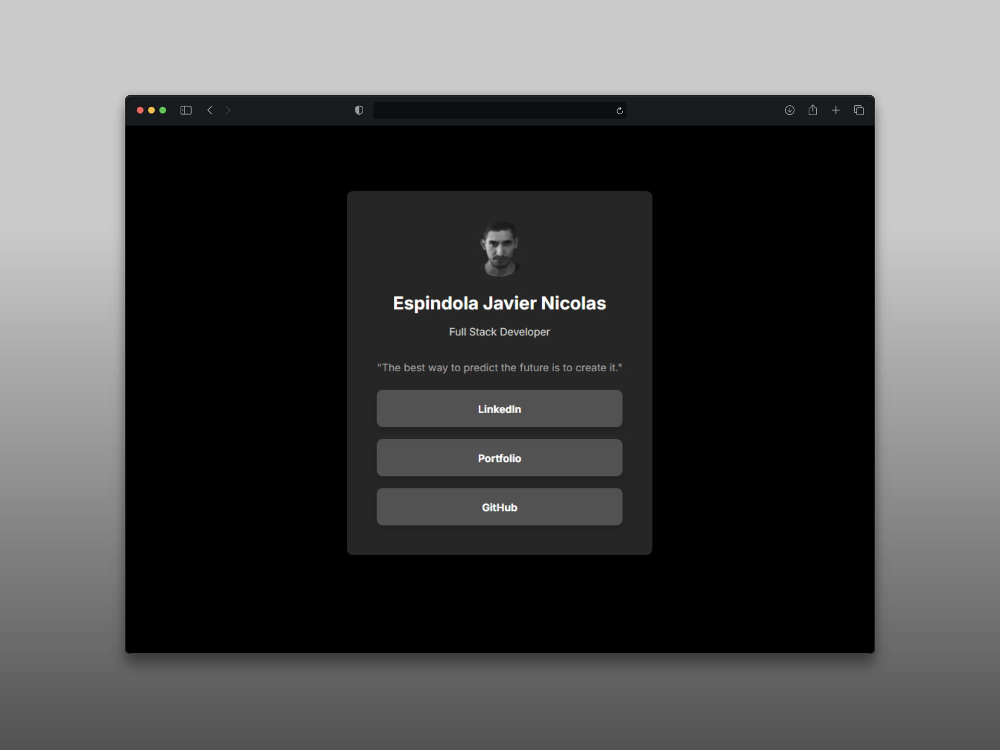

# My Personal Digital Hub



## 🌐 Mi Centro Digital Personal

Este proyecto es **My Personal Digital Hub**, una solución inspirada en el desafío "Social links profile" de [Frontend Mentor](https://www.google.com/search?q=https://www.frontendment.io), pero reinventado como mi propia versión de un "Linktree" personalizado. Aquí centralizo todos mis enlaces digitales más relevantes: desde mi perfil de LinkedIn y GitHub, hasta mi portafolio personal y cualquier otra presencia online que desee destacar. Es mi espacio para compartir de manera organizada y accesible quién soy digitalmente.

## 🚀 Tecnologías que Impulsan mi Hub

Este hub personal ha sido construido con una pila tecnológica moderna y robusta:

  - **Next.js 15.3.2**: Elegido por su rendimiento y las capacidades de desarrollo de aplicaciones React en producción.
  - **React 19**: La biblioteca base para la construcción de la interfaz de usuario, garantizando una experiencia fluida.
  - **TypeScript 5**: Implementado para asegurar un código robusto y mantenible a través del tipado estático.
  - **Tailwind CSS 4**: Utilizado para una estilización rápida y eficiente, permitiendo un diseño limpio y moderno.
  - **ESLint**: Fundamental para mantener un código de alta calidad y consistencia en todo el proyecto.

## ✨ Características de mi Hub Personal

Este proyecto ofrece las siguientes funcionalidades clave:

  - **Diseño Totalmente Responsive**: Mi hub se adapta perfectamente a cualquier dispositivo, desde móviles hasta desktops, con un enfoque mobile-first.
  - **Navegación Intuitiva**: Los enlaces cuentan con estados de `hover` y `focus` para una experiencia de usuario clara y accesible.
  - **Fiabilidad con TypeScript**: El código está fuertemente tipado para minimizar errores y mejorar la legibilidad y el mantenimiento.
  - **Optimización Automática**: Gracias a Next.js, las imágenes se optimizan automáticamente para una carga rápida y eficiente.
  - **Estilo Moderno y Limpio**: Tailwind CSS proporciona un diseño estético y consistente para una presentación profesional.

## 🛠️ Cómo Explorar Mi Hub (Instalación y Uso)

Si deseas ver el código o replicar la estructura de este hub en tu entorno, sigue estos pasos:

1.  **Clona este repositorio**:
    ```bash
    git clone https://github.com/Micolash89/PersonalHub
    cd PersonalHub
    ```
2.  **Instala las dependencias**:
    ```bash
    pnpm install
    ```
3.  **Ejecuta el servidor de desarrollo**:
    ```bash
    npm run dev
    # o
    pnpm dev
    ```

## 🎯 Mi Viaje de Aprendizaje con este Hub

Este proyecto ha sido una valiosa oportunidad para consolidar y expandir mis conocimientos en:

  - **TypeScript en la Práctica**: He aplicado el tipado estático de forma extensiva, mejorando la robustez y calidad del código.
  - **Next.js y sus Capacidades**: He explorado y utilizado características clave de Next.js como la optimización de imágenes y el enrutamiento.
  - **Diseño Responsive Avanzado**: He logrado un diseño adaptable que ofrece una experiencia consistente en diversas pantallas.
  - **Dominio de Tailwind CSS**: He profundizado en el uso de las utility classes para un desarrollo de estilos eficiente y escalable.

## 🌐 Visita Mi Hub en Vivo

Puedes acceder a la versión desplegada de mi Personal Digital Hub aquí:
[Explorar My Personal Digital Hub](https://espindola-links.vercel.app/) - Desplegado en Vercel.

